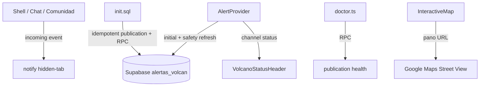

# Design — comparative-regression-closure

## Meta
- **Feature:** comparative-regression-closure
- **Author:** Codex
- **Status:** approved for apply
- **Date:** 2026-08-16
- **Spec:** `specs/comparative-regression-closure/requirements.md`

## Summary
Cerrar R1-R4 con cambios acotados en las superficies existentes: `AlertProvider`
conserva el último valor y consulta cada 30 s, doctor verifica readiness mediante
RPC de booleanos, notificaciones son opt-in/hidden-tab only, demo expone consola
local sin alterar full mode y mapa/copy recuperan pérdidas baratas.

## Technical Context
| Field | Value |
|---|---|
| Language/Version | TypeScript strict, Node 22, Next.js 16 / React 19 |
| Primary Dependencies | Supabase JS, Leaflet, Radix/shadcn, lucide-react |
| Storage | Supabase Postgres/Realtime; demo sessionStorage/in-memory |
| Testing | Vitest + Testing Library + V8 coverage |
| Target Platform | Browser desktop/mobile, Next.js server/client, Supabase |
| Project Type | Next.js client shell with operational scripts |
| Performance Goals | Safety refresh cada 30 s, sin requests solapados; sin permiso intrusivo |
| Constraints | No remote writes/deploy; RLS/RPC unchanged; no secrets en client/logs |
| Scale/Scope | Cuatro regresiones de portfolio/demo comunitario |

## Constitution Check
| Principle | Status | Evidence |
|---|---|---|
| Verificar antes de afirmar | ✅ | Tests, SQL contract, doctor y gates frescos. |
| Seguridad por capas | ✅ | Solo demo bypass; full role + RPC + RLS. |
| Cambios mínimos | ✅ | Contexto/listeners existentes y utilidades pequeñas. |
| Accesibilidad/honestidad | ✅ | Toggle etiquetado, provenance demo y enlaces seguros. |

## Technical Decisions
| Decision | Rejected Alternative | Reason |
|---|---|---|
| Safety refresh 30 s + channel status | Polling de 5 s heredado | Reduce carga y muestra estado; cubre silencio por publication. |
| RPC `verificar_publicaciones_realtime()` | Consultar catálogo desde browser | Encapsula catálogo y devuelve solo readiness booleano. |
| Toggle opt-in + notify hidden-tab | Permission request al montar | Respeta consentimiento. |
| Demo-only role bypass | Convertir demo user en operator | No mezcla identidad demo con autoridad. |
| Maps URL pano por viewpoint | Street View API con key | No agrega billing/dependencia y restaura el enlace requerido. |

## Architecture


## Data Model
```typescript
type RealtimeStatus = "idle" | "connecting" | "subscribed" | "channel_error" | "timed_out" | "closed";
interface AlertContextValue {
  alerta: AlertaVolcan | null;
  loading: boolean;
  hasError: boolean;
  realtimeStatus: RealtimeStatus;
  refresh: () => Promise<void>;
}
interface RealtimePublicationHealth {
  alertas_volcan: boolean;
  puntos_encuentro: boolean;
  avisos_comunidad: boolean;
  mensajes_chat: boolean;
}
```

## Project Structure
- `contexts/alert-context.tsx` — refresh deduplicado y estado Realtime.
- `components/volcano-status-header.tsx` — warning de canal no suscrito.
- `components/notification-toggle.tsx` / `lib/browser-notifications.ts` — opt-in SSR-safe.
- `components/chat-component.tsx` / `components/community-panel.tsx` — callers entrantes.
- `components/interactive-map.tsx` / `components/login-screen.tsx` / `app/page.tsx` — R3/R4.
- `scripts/init.sql` / `scripts/doctor.ts` — health RPC y gate publication.
- `__tests__/` — regresiones por historia.

**Structure Decision:** Las responsabilidades permanecen cerca de sus consumidores;
solo API de notificaciones y estado Realtime son superficies reutilizables. No se
introduce store global ni una capa de polling independiente.

## Dependencies
| Dependency | Version | Purpose |
|---|---|---|
| `@supabase/supabase-js` | lockfile | Consultas/RPC/Realtime existentes. |
| `leaflet` | lockfile | Mapa existente; no se agrega API Street View. |
| Browser Notification API | plataforma | Notificación opt-in sin dependencia. |

## Complexity Tracking
No hay violaciones de la constitución.

## Risks
| Risk | Mitigation |
|---|---|
| Fallback no detecta todos los fallos | `hasError`, status visible, query cada 30 s y doctor como preflight. |
| Permission denegado/API ausente | No-op cerrado y toggle explicativo. |
| RPC health no instalado | Doctor falla con instrucción explícita de rerun de `init.sql`. |
| URL sin cobertura | Google abre vista/mapa disponible; el enlace no se presenta como fuente oficial. |

## References
- `contexts/alert-context.tsx`, `scripts/init.sql`, `scripts/doctor.ts`.
- <https://developers.google.com/maps/documentation/urls/get-started>
