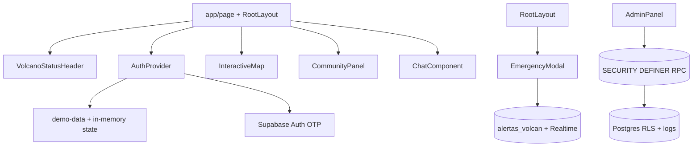

# Design — Vulcania: piso de confianza y rediseño

## Meta

- **Feature:** vulcania-confidence-redesign
- **Author:** Codex
- **Status:** approved for local implementation
- **Date:** 2026-08-16
- **Spec:** `specs/vulcania-confidence-redesign/requirements.md`

## Summary

La app mantiene su stack y reduce el riesgo concentrando contratos en `lib/`,
auth en `contexts/`, acceso sensible en SQL/RPC y presentación en componentes
pequeños. El shell puede renderizar la alerta pública antes del login; demo y
full mode comparten interfaces de dominio, pero no comparten mecanismos de
identidad.

## Technical Context

| Field | Value |
|---|---|
| **Language/Version** | TypeScript strict, React 19, Next.js 16 |
| **Primary Dependencies** | Tailwind 3, Radix UI, Leaflet, Supabase JS, Vitest |
| **Storage** | Supabase PostgreSQL/Auth en full; estado local de sesión + memoria en demo |
| **Testing** | Vitest + Testing Library; TypeScript; ESLint; Next build |
| **Target Platform** | Web responsive, Vercel-compatible |
| **Project Type** | Next.js App Router SPA-like client dashboard |
| **Performance Goals** | Leaflet una inicialización; Realtime sin polling; bundle no carga mapa antes de la pestaña |
| **Constraints** | Sin credenciales reales ni deploy; no depender de un backend adicional |
| **Scale/Scope** | Portfolio/demo y primer modo operativo Supabase |

## Constitution Check

| Principle | Status | Evidence |
|---|---|---|
| Cambiar lo mínimo necesario | ✅ | Se reutilizan shadcn, tabs, Supabase y Leaflet. |
| Root-cause-first | ✅ | Cada fix nace de un hallazgo reproducible de la auditoría. |
| No claims sin evidencia | ✅ | Demo y fuente oficial se rotulan por separado. |
| Seguridad | ✅ | RLS/RPC/Auth en SQL; la UI solo es defensa secundaria. |

## Technical Decisions

| Decision | Rejected Alternative | Reason |
|---|---|---|
| `alert-levels.ts` como mapa único | Configuración visual dispersa por componente | Evita labels/colores divergentes. |
| Supabase Auth OTP full | Lookup de `usuarios` + localStorage | Identidad verificable y compatible con `auth.uid()`. |
| `autor_nombre` para avisos + `perfiles_publicos` para chat | Join público de `usuarios` con teléfono | Reduce exposición de PII y simplifica RLS. |
| RPC SECURITY DEFINER para operator actions | Dos INSERT desde el cliente | Atomicidad, role check y auditoría en el servidor. |
| Una layer group de Leaflet | Recrear mapa/remontar por refresh key | Evita flashes y marcadores duplicados. |

## Architecture



## Data Model

```typescript
type AlertLevel = "verde" | "amarillo" | "naranja" | "rojo";
type UserRole = "user" | "operator" | "admin";

interface Usuario {
  id: string;
  nombre: string;
  telefono: string;
  rol: UserRole;
  fecha_creacion: string;
}

interface AlertaVolcan {
  id: string;
  nivel_alerta: AlertLevel;
  descripcion: string;
  fuente: string;
  es_simulacion: boolean;
  ultima_actualizacion: string;
  parametros_id?: string;
  volcan_id?: string;
}
```

## Project Structure

```text
lib/alert-levels.ts              # Contrato visual/semántico de niveles
lib/date-utils.ts                # Freshness y formato es-CL
lib/emergency-contacts.ts        # 131/132/133 desde fuente oficial
lib/alert-sound.ts               # AudioContext singleton y cleanup
contexts/auth-context.tsx        # Demo session vs Supabase Auth OTP
components/emergency-modal.tsx   # Único alertdialog global
components/interactive-map.tsx   # Mapa estable + lista textual accesible
components/{chat,community}-panel.tsx
scripts/init.sql                 # Schema/RLS/RPC/realtime/seed seguro
__tests__/                        # Contratos de formato, auth, login, UI
specs/vulcania-confidence-redesign/
```

**Structure Decision:** No se crea una capa API propia; los componentes
consumen Supabase directamente porque el proyecto ya es client-heavy. Las
operaciones sensibles se trasladan a SQL SECURITY DEFINER.

## Dependencies

| Dependency | Version | Purpose |
|---|---|---|
| `leaflet` | fija en `package.json` | mapa client-only |
| `@supabase/supabase-js` | fija por lockfile | Auth, queries y Realtime |
| `next/font` | incluida en Next | tipografía self-hosted |

## Risks

| Risk | Mitigation |
|---|---|
| OTP no habilitado en Supabase | UI reporta configuración y demo sigue funcionando. |
| Browser bloquea autoplay | AudioContext compartido, unlock por gesto y mute explícito. |
| Schema existente incompatible | `init.sql` documenta instalación limpia; doctor detecta faltantes. |
| Tiles externos caen | UI conserva lista textual; attribution visible. |
| Realtime no publicado | init y doctor verifican publication; UI marca conexión/stale. |

## References

- `DESIGN.md`
- `scripts/init.sql`
- [SERNAGEOMIN RNVV](https://www.sernageomin.cl/rnvv/)
- [SENAPRED](https://dev.senapred.cl/)
